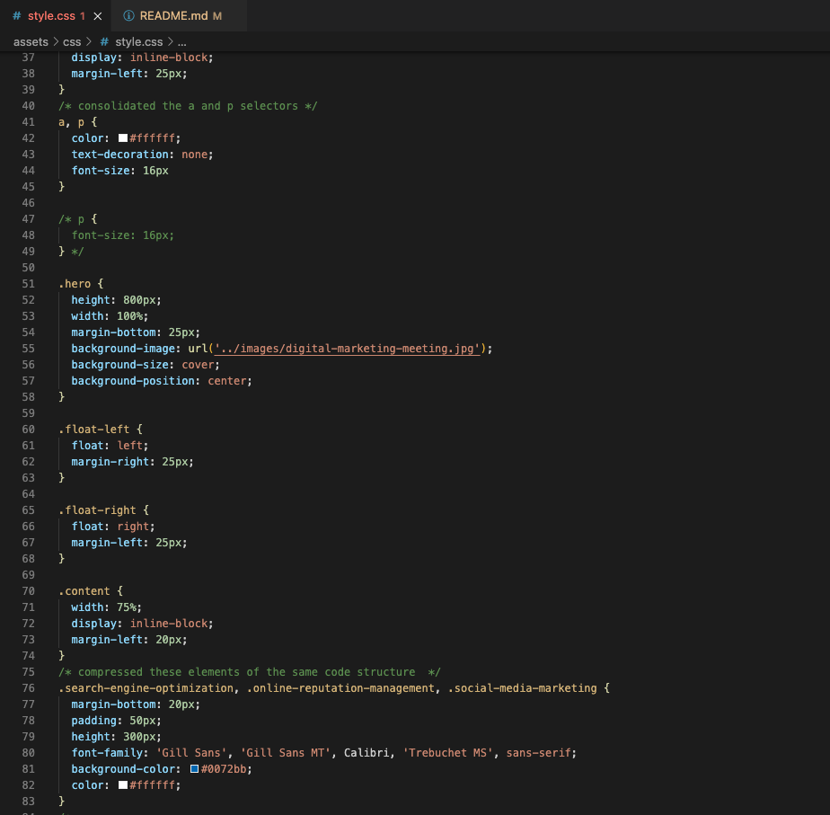

# horiseon-code-refactor

## description

I wanted to take something that was there and help to make it better. By adding code where needed and taking and consolidating where needed to make the code more streamline.
Fixed the html to provide working links, and restructured css to follow the semantic flow of the html.
I learned how make a clickable link on a webpage work and how to take code that was repeated and make it into a more ingestable structure. also how to title a page for the end user to see.

## installation

if you wish to see this "horiseon-code-refactor" in your visual studio code.

go to https://github.com/afredknot/horiseon-code-refactor

go to the code button

select https and copy

open the terminal on your computer

cd into the directory you wish to put it in

type git clone and paste the link you had copied and hit enter 

once the pull is complete type code . 

you visual studio code will open and you will be able to view the code

## usage

this is to hopefully help other devs see how to restructure their code into something a little more readable for the next person

```md
    
    ```

## credits

Ohio State University Full Stack Bootcamp for providing code to ammend

## License
MIT License